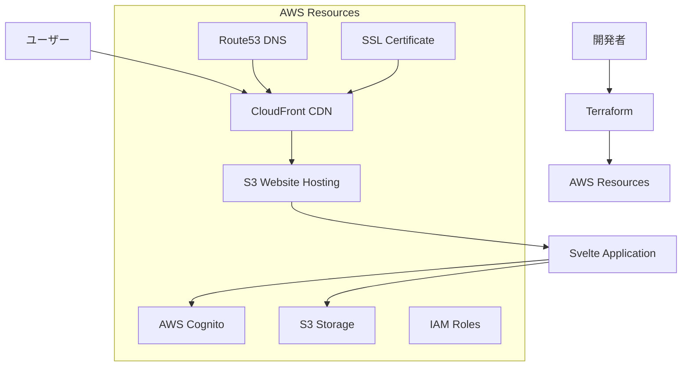
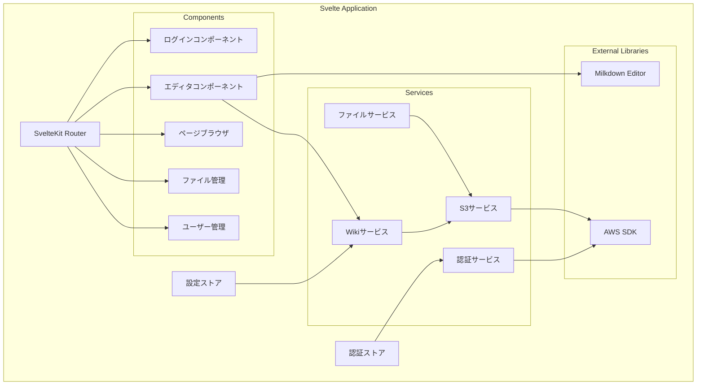
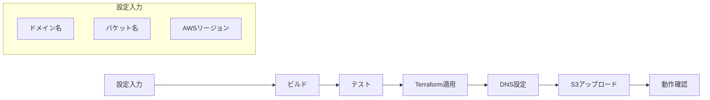

# 設計文書

## 概要

**MarkS3** - S3上でセルフホスティングされるmarkdown wikiシステムの設計。TypeScript/Svelteを使用したSPA（Single Page Application）として実装し、AWS Cognito認証とS3ストレージを直接利用するサーバレス構成を採用する。

## アーキテクチャ

### システム全体構成



### クライアントサイドアーキテクチャ



## コンポーネントとインターフェース

### 1. 認証システム

#### AuthService
```typescript
interface AuthService {
  login(username: string, password: string): Promise<AuthResult>
  logout(): Promise<void>
  getCurrentUser(): Promise<User | null>
  refreshToken(): Promise<string>
  checkPermission(action: string): boolean
}

interface User {
  id: string
  username: string
  role: UserRole
  email: string
}

enum UserRole {
  GUEST = 'guest',
  REGULAR = 'regular', 
  ADMIN = 'admin'
}
```

### 2. S3ストレージサービス

#### S3Service
```typescript
interface S3Service {
  // ページ操作
  getPage(path: string): Promise<WikiPage>
  savePage(page: WikiPage, etag?: string): Promise<SaveResult>
  deletePage(path: string): Promise<void>
  listPages(prefix?: string): Promise<WikiPageMeta[]>
  
  // ファイル操作
  uploadFile(file: File, path: string): Promise<string>
  deleteFile(path: string): Promise<void>
  listFiles(): Promise<FileInfo[]>
  getFileUrl(path: string): Promise<string>
  
  // 設定操作
  getConfig(): Promise<WikiConfig>
  saveConfig(config: WikiConfig): Promise<void>
  
  // メタデータ操作（原子性保証）
  updateMetadata(operation: MetadataOperation): Promise<void>
}

interface SaveResult {
  success: boolean
  etag: string
  conflict?: boolean
  conflictData?: WikiPage
}

interface MetadataOperation {
  type: 'add' | 'update' | 'delete'
  pageData: WikiPageMeta
  expectedVersion?: string
}
```

### 3. Wikiページ管理

#### WikiService
```typescript
interface WikiService {
  createPage(path: string, content: string): Promise<WikiPage>
  updatePage(path: string, content: string): Promise<WikiPage>
  getPage(path: string): Promise<WikiPage>
  deletePage(path: string): Promise<PageDeletionResult>
  searchPages(query: string): Promise<WikiPageMeta[]>
  getPageHierarchy(): Promise<PageNode[]>
  getPageAttachments(path: string): Promise<FileInfo[]>
}

interface PageDeletionResult {
  deletedPage: string
  orphanedFiles: FileInfo[]
  confirmationRequired: boolean
}

interface WikiPage {
  path: string
  title: string
  content: string
  metadata: PageMetadata
  etag?: string
}

interface PageMetadata {
  createdAt: Date
  updatedAt: Date
  author: string
  version: number
  tags?: string[]
}
```

### 4. ファイル管理

#### FileService
```typescript
interface FileService {
  uploadFile(file: File): Promise<FileInfo>
  deleteFile(fileId: string): Promise<void>
  getFileReferences(fileId: string): Promise<string[]>
  listFiles(): Promise<FileInfo[]>
  isImageFile(filename: string): boolean
  findOrphanedFiles(deletedPagePath: string): Promise<FileInfo[]>
  deleteOrphanedFiles(fileIds: string[]): Promise<void>
}

interface FileInfo {
  id: string
  filename: string
  size: number
  contentType: string
  uploadedAt: Date
  url: string
}
```

## データモデル

### S3バケット構造

```
s3://MarkS3-bucket-name/
├── pages/                    # Markdownページ
│   ├── index.md
│   ├── folder1/
│   │   ├── page1.md
│   │   └── subfolder/
│   │       └── page2.md
│   └── folder2/
│       └── page3.md
├── files/                    # アップロードファイル
│   ├── images/
│   │   ├── image1.png
│   │   └── image2.jpg
│   └── documents/
│       ├── doc1.pdf
│       └── doc2.docx
├── metadata/                 # メタデータ
│   ├── pages.json           # ページ一覧とメタデータ
│   └── files.json           # ファイル一覧とメタデータ
└── config/                   # 設定ファイル
    ├── wiki.json            # Wiki設定
    └── users.json           # ユーザー管理（Admin用）
```

### 設定ファイル構造

#### wiki.json
```json
{
  "title": "MarkS3 Wiki",
  "description": "S3-hosted markdown wiki system",
  "allowGuestAccess": true,
  "theme": "default",
  "features": {
    "fileUpload": true,
    "userManagement": true
  }
}
```

#### pages.json
```json
{
  "pages": [
    {
      "path": "index.md",
      "title": "Home",
      "createdAt": "2024-01-01T00:00:00Z",
      "updatedAt": "2024-01-01T00:00:00Z",
      "author": "admin",
      "tags": ["home"]
    }
  ]
}
```

## エラーハンドリング

### エラー分類と対応

1. **認証エラー**
   - トークン期限切れ → 自動リフレッシュまたは再ログイン
   - 権限不足 → エラーメッセージ表示とリダイレクト

2. **S3アクセスエラー**
   - バケット不存在 → 初期化プロセス実行
   - 権限不足 → 詳細なエラーメッセージ表示
   - ネットワークエラー → リトライ機能

3. **ファイル操作エラー**
   - ファイルサイズ制限 → アップロード前チェック
   - 不正なファイル形式 → バリデーション実装

4. **ページ削除時の処理**
   - 添付ファイルの参照チェック
   - 孤立ファイルの確認ダイアログ表示
   - ユーザー確認後の一括削除

5. **同時編集の競合**
   - 楽観的ロック（ETag使用）
   - 競合検出時の警告表示
   - マージ支援機能の提供

### エラーハンドリング実装

```typescript
class WikiError extends Error {
  constructor(
    public code: string,
    public message: string,
    public details?: any
  ) {
    super(message)
  }
}

enum ErrorCodes {
  AUTH_FAILED = 'AUTH_FAILED',
  PERMISSION_DENIED = 'PERMISSION_DENIED',
  S3_ACCESS_DENIED = 'S3_ACCESS_DENIED',
  FILE_TOO_LARGE = 'FILE_TOO_LARGE',
  BUCKET_NOT_FOUND = 'BUCKET_NOT_FOUND',
  ORPHANED_FILES_FOUND = 'ORPHANED_FILES_FOUND',
  EDIT_CONFLICT = 'EDIT_CONFLICT'
}

// ページ削除時の処理フロー
async function deletePage(path: string): Promise<void> {
  const orphanedFiles = await fileService.findOrphanedFiles(path)
  
  if (orphanedFiles.length > 0) {
    const userConfirmed = await showOrphanedFilesDialog(orphanedFiles)
    if (userConfirmed) {
      await fileService.deleteOrphanedFiles(orphanedFiles.map(f => f.id))
    }
  }
  
  await wikiService.deletePage(path)
}

// 同時編集競合の処理フロー
async function savePage(page: WikiPage): Promise<void> {
  try {
    const result = await s3Service.savePage(page, page.etag)
    
    if (result.conflict) {
      const resolution = await showConflictDialog(page, result.conflictData)
      if (resolution.merge) {
        const mergedPage = await mergePages(page, result.conflictData)
        await savePage(mergedPage)
      }
    }
  } catch (error) {
    if (error.code === 'EDIT_CONFLICT') {
      // 競合処理
    }
  }
}
```

## テスト戦略

### 1. 単体テスト
- サービスクラスの各メソッド
- ユーティリティ関数
- バリデーション機能

### 2. 統合テスト
- AWS SDK連携
- 認証フロー
- ファイルアップロード/ダウンロード

### 3. E2Eテスト
- ユーザーログインから記事作成まで
- ファイルアップロードと参照
- 権限制御の動作確認

### テスト環境構成

```typescript
// テスト用のモックサービス
interface MockS3Service extends S3Service {
  mockData: Map<string, any>
  reset(): void
}

// テスト用設定
const testConfig = {
  aws: {
    region: 'us-east-1',
    bucketName: 'test-marks3-bucket',
    cognitoUserPoolId: 'test-pool-id'
  }
}
```

## セキュリティ考慮事項

### 1. 認証・認可
- Cognito JWTトークンによる認証
- ロールベースアクセス制御（RBAC）
- トークンの安全な保存（httpOnly cookie推奨）

### 2. S3セキュリティ
- バケットポリシーによるアクセス制限
- CORS設定の適切な構成
- 署名付きURLによるファイルアクセス

### 3. クライアントサイドセキュリティ
- XSS対策（サニタイゼーション）
- CSRF対策
- 機密情報のローカルストレージ回避

### セキュリティ実装例

```typescript
// XSS対策
function sanitizeMarkdown(content: string): string {
  return DOMPurify.sanitize(content)
}

// 権限チェック
function requirePermission(action: string) {
  return (target: any, propertyKey: string, descriptor: PropertyDescriptor) => {
    const originalMethod = descriptor.value
    descriptor.value = function(...args: any[]) {
      if (!authService.checkPermission(action)) {
        throw new WikiError('PERMISSION_DENIED', 'Insufficient permissions')
      }
      return originalMethod.apply(this, args)
    }
  }
}
```

## パフォーマンス最適化

### 1. フロントエンド最適化
- コード分割（SvelteKitの動的インポート）
- 画像の遅延読み込み
- マークダウンプレビューのデバウンス

### 2. S3最適化
- ページ一覧のキャッシュ
- ファイルのプリフェッチ
- CloudFrontによるCDN配信

### 3. メモリ管理
- 大きなファイルの分割アップロード
- 不要なデータの適切な破棄
- メモリリークの防止

## デプロイメント戦略

### 1. 開発環境
- ローカル開発用のモックサービス
- Hot reloadによる高速開発
- テスト用のAWSリソース

### 2. 本番環境
- Terraformによるインフラ管理
- CloudFrontによるCDN配信
- カスタムドメイン名の設定
- 本番用のセキュリティ設定

### 3. ビルド時設定
- ドメイン名の指定（例：wiki.example.com）
- S3バケット名の指定
- AWS リージョンの選択
- SSL証明書の自動設定（AWS Certificate Manager）
- Route53ホストゾーンの設定（カスタムドメイン使用時）

### 4. DNS設定オプション
- **オプション1**: 既存のRoute53ホストゾーンを使用
- **オプション2**: 新しいRoute53ホストゾーンを作成
- **オプション3**: 外部DNSプロバイダーを使用（手動設定）

### デプロイメントフロー



### ビルド設定ファイル例

```json
{
  "domain": "wiki.example.com",
  "bucketName": "my-marks3-wiki",
  "region": "ap-northeast-1",
  "dnsConfig": {
    "provider": "route53",
    "createHostedZone": true,
    "hostedZoneId": "Z1D633PJN98FT9"
  },
  "ssl": {
    "autoCreate": true,
    "certificateArn": "arn:aws:acm:us-east-1:123456789012:certificate/12345678-1234-1234-1234-123456789012"
  }
}
```

### DNS設定の詳細

1. **Route53を使用する場合**:
   - 新しいホストゾーンの作成またはの既存使用
   - CloudFrontディストリビューションへのAレコード自動設定
   - SSL証明書の自動検証

2. **外部DNSを使用する場合**:
   - CloudFrontのドメイン名を手動でCNAMEレコードに設定
   - SSL証明書の手動検証が必要