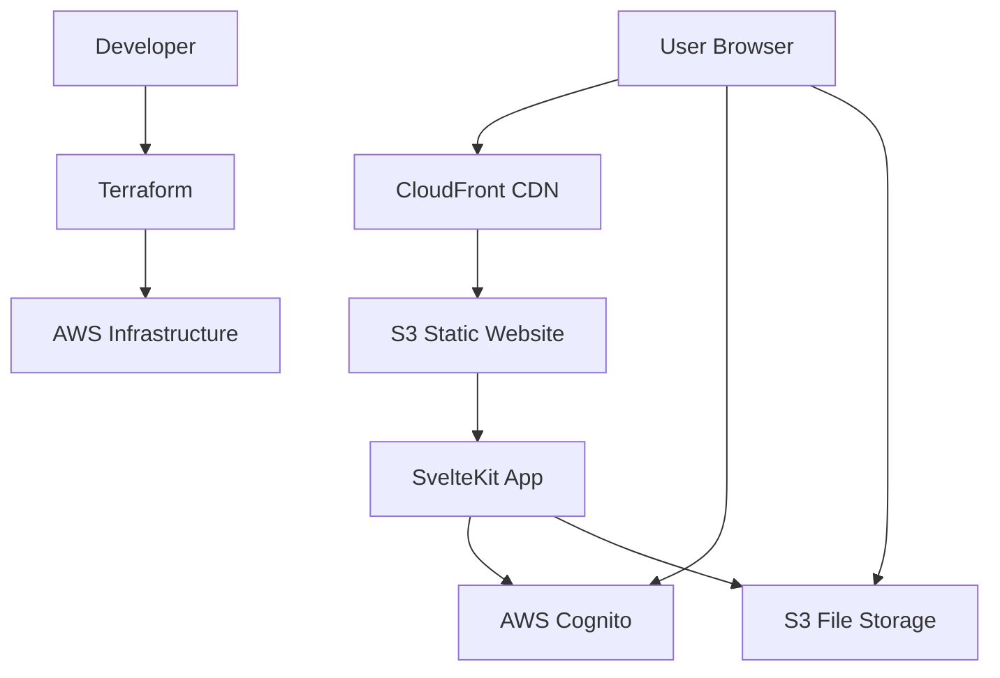

# MarkS3 - Serverless Markdown Wiki

<div align="center">


**A modern, serverless markdown wiki system powered by AWS**

[](https://opensource.org/licenses/MIT)
[](https://nodejs.org/)
[](https://www.typescriptlang.org/)
[](https://svelte.dev/)
[](https://aws.amazon.com/)

[Features](#features) • [Quick Start](#quick-start) • [Installation](#installation) • [Documentation](#documentation) • [Contributing](#contributing)

</div>

## 🌟 Overview

MarkS3 is a **completely serverless** markdown wiki system that runs entirely on AWS infrastructure without requiring any backend servers. Built with modern web technologies, it provides a rich editing experience while maintaining cost-effectiveness and scalability.

### Why MarkS3?

- **💰 Cost-Effective**: Pay only for what you use - no server maintenance costs
- **🚀 Serverless**: Zero server management, automatic scaling
- **🔒 Secure**: AWS Cognito authentication with role-based access control
- **📱 Modern**: Rich markdown editing with real-time preview
- **🌍 Global**: CloudFront CDN for worldwide performance
- **🛠️ Self-Hosted**: Complete control over your data and infrastructure

## ✨ Features

### Core Functionality
- 📝 **Rich Markdown Editor**: Powered by Milkdown with real-time preview
- 🔐 **Authentication**: AWS Cognito with role-based access (Guest, Regular, Admin)
- 📁 **Hierarchical Organization**: Organize pages in folders and subfolders
- 🔍 **Full-Text Search**: Search across all pages and content
- 📎 **File Management**: Upload and manage images, documents, and other files
- 🔄 **Concurrent Editing**: Optimistic locking prevents edit conflicts

### Technical Features
- 🌐 **Custom Domain**: SSL-enabled custom domain support
- 📱 **Responsive Design**: Works perfectly on desktop and mobile
- 🎨 **Modern UI**: Clean, intuitive interface built with Svelte
- 🔧 **TypeScript**: Full type safety throughout the application
- 🧪 **Comprehensive Testing**: Unit, integration, and E2E tests
- 📊 **Infrastructure as Code**: Terraform for reproducible deployments

### Security & Performance
- 🛡️ **XSS Protection**: DOMPurify sanitization for markdown content
- 🔐 **Secure Authentication**: AWS Cognito identity management
- ⚡ **Fast Loading**: CloudFront CDN with optimized caching
- 📈 **Scalable**: Automatically scales with AWS infrastructure

## 🚀 Quick Start

### Prerequisites

Before you begin, ensure you have:

- **AWS Account** with administrative access
- **Node.js 18+** and **pnpm** package manager
- **Terraform 1.0+** for infrastructure management
- **Git** for version control

### 1-Minute Setup

```bash
# Clone the repository
git clone https://github.com/YOUR_USERNAME/marks3.git
cd marks3

# Install dependencies
pnpm install

# Configure AWS credentials (if not already done)
aws configure

# Initialize and deploy infrastructure
pnpm terraform:init
pnpm terraform:apply

# Build and deploy the application
pnpm build
pnpm deploy
```

## 📋 Installation

### Step 1: Environment Setup

1. **Install Node.js and pnpm**
   ```bash
   # Using Node Version Manager (recommended)
   nvm install 18
   nvm use 18
   
   # Install pnpm
   npm install -g pnpm
   ```

2. **Install Terraform**
   ```bash
   # macOS (using Homebrew)
   brew install terraform
   
   # Windows (using Chocolatey)
   choco install terraform
   
   # Linux (using package manager)
   sudo apt-get install terraform  # Ubuntu/Debian
   ```

3. **Configure AWS CLI**
   ```bash
   # Install AWS CLI
   pip install awscli
   
   # Configure credentials
   aws configure
   ```

### Step 2: Project Setup

1. **Clone and Install Dependencies**
   ```bash
   git clone https://github.com/YOUR_USERNAME/marks3.git
   cd marks3
   pnpm install
   ```

2. **Configure Environment Variables**
   ```bash
   # Copy environment template
   cp .env.example .env
   
   # Edit configuration
   nano .env
   ```

   Required environment variables:
   ```env
   # AWS Configuration
   AWS_REGION=us-east-1
   AWS_PROFILE=default
   
   # Application Configuration
   VITE_APP_NAME=MarkS3
   VITE_APP_DOMAIN=your-domain.com
   
   # Terraform Configuration
   TF_VAR_project_name=marks3
   TF_VAR_environment=prod
   ```

### Step 3: Infrastructure Deployment

1. **Initialize Terraform**
   ```bash
   cd terraform
   terraform init
   ```

2. **Plan Infrastructure Changes**
   ```bash
   terraform plan -var-file="environments/prod/terraform.tfvars"
   ```

3. **Deploy Infrastructure**
   ```bash
   terraform apply -var-file="environments/prod/terraform.tfvars"
   ```

   This creates:
   - S3 bucket for static hosting
   - S3 bucket for file storage
   - Cognito User Pool and Identity Pool
   - CloudFront distribution
   - Route53 records (if custom domain configured)

### Step 4: Application Deployment

1. **Build the Application**
   ```bash
   pnpm build
   ```

2. **Deploy to S3**
   ```bash
   pnpm deploy
   ```

3. **Verify Deployment**
   ```bash
   # Get the CloudFront URL from Terraform output
   terraform output cloudfront_url
   ```

## ⚙️ Configuration

### AWS Configuration

#### Required AWS Permissions

Your AWS user/role needs the following permissions:

```json
{
  "Version": "2012-10-17",
  "Statement": [
    {
      "Effect": "Allow",
      "Action": [
        "s3:*",
        "cognito-idp:*",
        "cognito-identity:*",
        "cloudfront:*",
        "route53:*",
        "acm:*",
        "iam:*"
      ],
      "Resource": "*"
    }
  ]
}
```

#### Terraform Variables

Configure `terraform/environments/prod/terraform.tfvars`:

```hcl
# Project Configuration
project_name = "marks3"
environment  = "prod"

# Domain Configuration (optional)
domain_name = "wiki.yourdomain.com"
zone_id     = "Z1234567890ABC"

# Cognito Configuration
cognito_domain_prefix = "marks3-auth"

# S3 Configuration
enable_versioning = true
enable_encryption = true

# CloudFront Configuration
price_class = "PriceClass_100"  # US, Canada, Europe
```

### Application Configuration

#### Wiki Settings

Configure your wiki in `src/lib/config/app.ts`:

```typescript
export const wikiConfig = {
  name: 'My Wiki',
  description: 'A knowledge base for my team',
  defaultPage: 'index',
  allowGuestAccess: true,
  maxFileSize: 10 * 1024 * 1024, // 10MB
  allowedFileTypes: ['.jpg', '.png', '.pdf', '.docx'],
  theme: 'light' // 'light' | 'dark' | 'auto'
};
```

## 📖 Usage

### Creating Your First Page

1. **Access the Wiki**
   - Open your CloudFront URL or custom domain
   - Sign up for a new account or log in

2. **Create a Page**
   - Click "New Page" in the navigation
   - Enter a page title and path
   - Start writing in markdown

3. **Rich Editing Features**
   - **Bold**: `**text**` or Ctrl+B
   - **Italic**: `*text*` or Ctrl+I
   - **Links**: `[text](url)` or Ctrl+K
   - **Images**: Drag and drop or use the upload button
   - **Tables**: Use the table toolbar
   - **Code**: ``` for code blocks

### Managing Users and Permissions

#### User Roles

- **Guest**: Read-only access to public pages
- **Regular**: Can create and edit pages
- **Admin**: Full access including user management

#### Adding Users (Admin Only)

1. Go to Admin Panel → User Management
2. Click "Invite User"
3. Enter email and select role
4. User receives invitation email

### File Management

#### Uploading Files

1. **In Editor**: Drag and drop files directly into the editor
2. **File Manager**: Use the dedicated file management interface
3. **API**: Upload programmatically via the REST API

#### Supported File Types

- **Images**: JPG, PNG, GIF, WebP, SVG
- **Documents**: PDF, DOC, DOCX, TXT, MD
- **Archives**: ZIP, TAR, GZ
- **Custom**: Configure additional types in settings

### Search and Navigation

#### Full-Text Search

- Use the search bar in the top navigation
- Search supports:
  - Page titles and content
  - File names and metadata
  - Tags and categories

#### Page Organization

- **Hierarchical Structure**: Organize pages in folders
- **Breadcrumbs**: Navigate page hierarchy easily
- **Page Tree**: Visual page structure in sidebar

## 🔧 Development

### Development Commands

```bash
# Development server with hot reload
pnpm dev

# Build for production
pnpm build

# Preview production build
pnpm preview

# Run all tests
pnpm test

# Run tests in watch mode
pnpm test:watch

# Type checking
pnpm check

# Lint code
pnpm lint

# Format code
pnpm format

# Validate Terraform
pnpm terraform:validate
```

### Project Structure

```
marks3/
├── .kiro/                    # Kiro IDE specifications and steering
│   ├── specs/               # Feature specifications
│   └── steering/            # AI assistant guidance rules
├── src/                     # Source code (SvelteKit application)
│   ├── lib/
│   │   ├── components/      # Svelte components
│   │   ├── services/        # Business logic services
│   │   ├── stores/          # State management
│   │   ├── types/           # TypeScript type definitions
│   │   └── utils/           # Utility functions
│   ├── routes/              # SvelteKit routes
│   └── app.html             # HTML template
├── terraform/               # Infrastructure as Code
│   ├── modules/             # Reusable Terraform modules
│   └── environments/        # Environment-specific configurations
├── tests/                   # Test files
│   ├── unit/               # Unit tests
│   ├── integration/        # Integration tests
│   └── e2e/                # End-to-end tests
├── docs/                    # Documentation
├── scripts/                 # Build and deployment scripts
└── static/                  # Static assets
```

### Adding New Features

1. **Create Feature Specification**
   ```bash
   # Create new spec in .kiro/specs/
   mkdir .kiro/specs/new-feature
   ```

2. **Follow Development Workflow**
   - Requirements gathering
   - Design documentation
   - Implementation planning
   - Code implementation
   - Testing and validation

3. **Testing Requirements**
   - Unit tests for business logic
   - Integration tests for AWS services
   - E2E tests for user workflows

## 📚 Documentation

### Additional Documentation

- [API Reference](docs/api.md) - Complete API documentation
- [Architecture Guide](docs/architecture.md) - System architecture and design decisions
- [Development Guide](docs/development.md) - Detailed development setup and guidelines
- [Deployment Guide](docs/deployment.md) - Production deployment best practices
- [Troubleshooting](docs/troubleshooting.md) - Common issues and solutions

### Architecture Overview



## ❓ FAQ

### General Questions

**Q: What makes MarkS3 different from other wiki systems?**
A: MarkS3 is completely serverless, running entirely on AWS infrastructure without any backend servers. This makes it extremely cost-effective and scalable while providing enterprise-grade security.

**Q: How much does it cost to run MarkS3?**
A: Costs depend on usage, but typically:
- S3 storage: ~$0.023/GB/month
- CloudFront: ~$0.085/GB for first 10TB
- Cognito: Free for first 50,000 MAUs
- Total: Usually under $10/month for small to medium wikis

**Q: Can I use my own domain?**
A: Yes! MarkS3 supports custom domains with SSL certificates via AWS Certificate Manager and Route53.

### Technical Questions

**Q: What happens if AWS services go down?**
A: MarkS3 leverages AWS's high availability. S3 has 99.999999999% (11 9's) durability, and CloudFront provides global redundancy.

**Q: Can I backup my data?**
A: Yes, all data is stored in S3 with optional versioning enabled. You can also set up cross-region replication for additional backup.

**Q: Is it secure for sensitive information?**
A: MarkS3 uses AWS Cognito for authentication, S3 bucket policies for access control, and DOMPurify for XSS protection. However, evaluate your specific security requirements.

### Setup Questions

**Q: I'm getting AWS permission errors during setup.**
A: Ensure your AWS user has the required permissions listed in the Configuration section. You may need to attach the AdministratorAccess policy temporarily during initial setup.

**Q: Terraform apply fails with resource conflicts.**
A: This usually happens if resources already exist. Check the Terraform state and consider importing existing resources or using different resource names.

**Q: The application loads but I can't authenticate.**
A: Verify that:
- Cognito User Pool is properly configured
- CORS settings allow your domain
- Environment variables are correctly set

## 🐛 Troubleshooting

### Common Issues

#### Build and Deployment Issues

**Issue**: `pnpm install` fails with dependency conflicts
```bash
# Solution: Clear cache and reinstall
rm -rf node_modules pnpm-lock.yaml
pnpm install
```

**Issue**: Terraform apply fails with "bucket already exists"
```bash
# Solution: Import existing bucket or use different name
terraform import aws_s3_bucket.main existing-bucket-name
```

**Issue**: CloudFront deployment takes too long
```bash
# This is normal - CloudFront deployments can take 15-45 minutes
# Check status: aws cloudfront get-distribution --id YOUR_DISTRIBUTION_ID
```

#### Runtime Issues

**Issue**: Pages don't load after deployment
1. Check CloudFront distribution status
2. Verify S3 bucket policy allows CloudFront access
3. Check browser console for CORS errors

**Issue**: Authentication doesn't work
1. Verify Cognito User Pool configuration
2. Check that redirect URLs are correctly configured
3. Ensure HTTPS is used (required for Cognito)

**Issue**: File uploads fail
1. Check S3 bucket CORS configuration
2. Verify file size limits
3. Check browser network tab for error details

#### Performance Issues

**Issue**: Slow page loading
1. Enable CloudFront caching
2. Optimize image sizes
3. Check S3 region proximity to users

**Issue**: Search is slow
1. Implement search indexing
2. Consider using AWS OpenSearch for large wikis
3. Optimize search queries

### Getting Help

1. **Check the logs**:
   ```bash
   # Browser console logs
   # CloudFront logs (if enabled)
   # S3 access logs (if enabled)
   ```

2. **Verify configuration**:
   ```bash
   # Check Terraform outputs
   terraform output
   
   # Verify AWS resources
   aws s3 ls
   aws cognito-idp list-user-pools --max-items 10
   ```

3. **Community Support**:
   - [GitHub Issues](https://github.com/YOUR_USERNAME/marks3/issues)
   - [Discussions](https://github.com/YOUR_USERNAME/marks3/discussions)

## 🤝 Contributing

We welcome contributions! Please see our [Contributing Guide](CONTRIBUTING.md) for details.

### Quick Contribution Steps

1. Fork the repository
2. Create a feature branch: `git checkout -b feature/amazing-feature`
3. Make your changes and add tests
4. Commit: `git commit -m 'Add amazing feature'`
5. Push: `git push origin feature/amazing-feature`
6. Open a Pull Request

### Development Setup for Contributors

```bash
# Fork and clone your fork
git clone https://github.com/YOUR_USERNAME/marks3.git
cd marks3

# Add upstream remote
git remote add upstream https://github.com/ORIGINAL_OWNER/marks3.git

# Install dependencies
pnpm install

# Create feature branch
git checkout -b feature/your-feature

# Start development server
pnpm dev
```

## 📄 License

This project is licensed under the MIT License - see the [LICENSE](LICENSE) file for details.

## 🙏 Acknowledgments

- [Svelte](https://svelte.dev/) - The web framework
- [Milkdown](https://milkdown.dev/) - The markdown editor
- [AWS](https://aws.amazon.com/) - Cloud infrastructure
- [Terraform](https://terraform.io/) - Infrastructure as Code
- [TypeScript](https://www.typescriptlang.org/) - Type safety

## 📊 Project Status

- ✅ Core functionality implemented
- ✅ AWS infrastructure setup
- ✅ Authentication system
- ✅ File management
- ✅ Comprehensive testing
- 🚧 Documentation (in progress)
- 📋 Planned: Advanced search features
- 📋 Planned: Plugin system

---

<div align="center">

**Built with ❤️ by the MarkS3 community**

[⭐ Star this project](https://github.com/YOUR_USERNAME/marks3) • [🐛 Report Bug](https://github.com/YOUR_USERNAME/marks3/issues) • [💡 Request Feature](https://github.com/YOUR_USERNAME/marks3/issues)

</div>