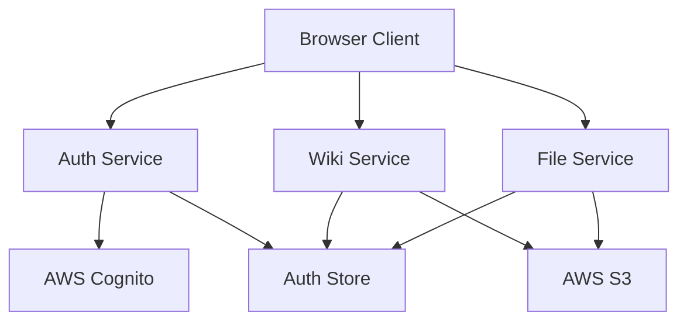

# MarkS3 API Reference

This document provides comprehensive API documentation for MarkS3, including client-side services, AWS integrations, and internal APIs.

## Table of Contents

- [Overview](#overview)
- [Authentication](#authentication)
- [Wiki Service API](#wiki-service-api)
- [File Service API](#file-service-api)
- [User Management API](#user-management-api)
- [Configuration API](#configuration-api)
- [AWS Service Integrations](#aws-service-integrations)
- [Error Handling](#error-handling)
- [Type Definitions](#type-definitions)

## Overview

MarkS3 is a client-side application that communicates directly with AWS services. The API consists of:

- **Client-side Services**: TypeScript services that handle business logic
- **AWS SDK Integrations**: Direct communication with S3, Cognito, and other AWS services
- **State Management**: Svelte stores for application state
- **Utility Functions**: Helper functions for validation, formatting, and security

### Architecture



## Authentication

### Auth Service (`src/lib/services/auth.ts`)

The authentication service handles user authentication using AWS Cognito.

#### `signUp(email: string, password: string, attributes?: UserAttributes): Promise<SignUpResult>`

Creates a new user account.

**Parameters:**
- `email` (string): User's email address
- `password` (string): User's password (must meet Cognito password policy)
- `attributes` (UserAttributes, optional): Additional user attributes

**Returns:** `Promise<SignUpResult>`

**Example:**
```typescript
import { authService } from '$lib/services/auth';

try {
  const result = await authService.signUp(
    'user@example.com',
    'SecurePassword123!',
    { given_name: 'John', family_name: 'Doe' }
  );
  console.log('User created:', result.userSub);
} catch (error) {
  console.error('Sign up failed:', error);
}
```

#### `confirmSignUp(email: string, confirmationCode: string): Promise<void>`

Confirms user registration with verification code.

**Parameters:**
- `email` (string): User's email address
- `confirmationCode` (string): 6-digit confirmation code from email

**Example:**
```typescript
await authService.confirmSignUp('user@example.com', '123456');
```

#### `signIn(email: string, password: string): Promise<AuthenticationResult>`

Authenticates a user and returns tokens.

**Parameters:**
- `email` (string): User's email address
- `password` (string): User's password

**Returns:** `Promise<AuthenticationResult>`

**Example:**
```typescript
const result = await authService.signIn('user@example.com', 'password');
console.log('Access token:', result.AccessToken);
```

#### `signOut(): Promise<void>`

Signs out the current user and clears tokens.

#### `getCurrentUser(): Promise<User | null>`

Gets the currently authenticated user information.

**Returns:** `Promise<User | null>`

#### `refreshToken(): Promise<AuthenticationResult>`

Refreshes the current user's access token.

#### `changePassword(oldPassword: string, newPassword: string): Promise<void>`

Changes the current user's password.

#### `forgotPassword(email: string): Promise<void>`

Initiates password reset flow.

#### `confirmForgotPassword(email: string, confirmationCode: string, newPassword: string): Promise<void>`

Completes password reset with confirmation code.

### Auth Store (`src/lib/stores/auth.ts`)

Reactive store for authentication state.

#### Store Properties

```typescript
interface AuthStore {
  user: User | null;
  isAuthenticated: boolean;
  isLoading: boolean;
  tokens: {
    accessToken: string | null;
    refreshToken: string | null;
    idToken: string | null;
  };
}
```

#### Usage

```typescript
import { authStore } from '$lib/stores/auth';

// Subscribe to auth state changes
authStore.subscribe(($auth) => {
  if ($auth.isAuthenticated) {
    console.log('User is logged in:', $auth.user);
  }
});

// Check if user is authenticated
import { get } from 'svelte/store';
const isLoggedIn = get(authStore).isAuthenticated;
```

## Wiki Service API

### Wiki Service (`src/lib/services/wiki.ts`)

Handles wiki page operations with S3 storage.

#### `getPage(path: string): Promise<WikiPage>`

Retrieves a wiki page by path.

**Parameters:**
- `path` (string): Page path (e.g., 'docs/getting-started')

**Returns:** `Promise<WikiPage>`

**Example:**
```typescript
import { wikiService } from '$lib/services/wiki';

const page = await wikiService.getPage('docs/getting-started');
console.log('Page content:', page.content);
```

#### `savePage(page: WikiPage): Promise<WikiPage>`

Saves a wiki page to S3.

**Parameters:**
- `page` (WikiPage): Page object with content and metadata

**Returns:** `Promise<WikiPage>` - Updated page with new ETag

**Example:**
```typescript
const page: WikiPage = {
  path: 'docs/new-page',
  title: 'New Page',
  content: '# Hello World\n\nThis is a new page.',
  metadata: {
    author: 'user@example.com',
    created: new Date(),
    modified: new Date(),
    tags: ['documentation']
  }
};

const savedPage = await wikiService.savePage(page);
```

#### `deletePage(path: string): Promise<void>`

Deletes a wiki page.

**Parameters:**
- `path` (string): Page path to delete

#### `listPages(prefix?: string): Promise<PageMetadata[]>`

Lists all pages or pages with a specific prefix.

**Parameters:**
- `prefix` (string, optional): Path prefix to filter pages

**Returns:** `Promise<PageMetadata[]>`

**Example:**
```typescript
// List all pages
const allPages = await wikiService.listPages();

// List pages in 'docs' folder
const docsPages = await wikiService.listPages('docs/');
```

#### `searchPages(query: string): Promise<SearchResult[]>`

Searches pages by content and title.

**Parameters:**
- `query` (string): Search query

**Returns:** `Promise<SearchResult[]>`

#### `getPageHistory(path: string): Promise<PageVersion[]>`

Gets version history for a page (if S3 versioning is enabled).

#### `restorePageVersion(path: string, versionId: string): Promise<WikiPage>`

Restores a specific version of a page.

### Page Structure

#### WikiPage Interface

```typescript
interface WikiPage {
  path: string;           // Unique page path
  title: string;          // Page title
  content: string;        // Markdown content
  metadata: PageMetadata; // Page metadata
  etag?: string;          // S3 ETag for optimistic locking
}
```

#### PageMetadata Interface

```typescript
interface PageMetadata {
  author: string;         // Author email
  created: Date;          // Creation timestamp
  modified: Date;         // Last modification timestamp
  tags: string[];         // Page tags
  description?: string;   // Page description
  isPublic: boolean;      // Public visibility flag
  permissions: {          // Access permissions
    read: UserRole[];
    write: UserRole[];
  };
}
```

## File Service API

### File Service (`src/lib/services/files.ts`)

Handles file upload, management, and organization.

#### `uploadFile(file: File, path?: string): Promise<FileMetadata>`

Uploads a file to S3.

**Parameters:**
- `file` (File): File object from input or drag-drop
- `path` (string, optional): Custom path for the file

**Returns:** `Promise<FileMetadata>`

**Example:**
```typescript
import { fileService } from '$lib/services/files';

const fileInput = document.querySelector('input[type="file"]');
const file = fileInput.files[0];

const metadata = await fileService.uploadFile(file, 'images/');
console.log('File uploaded:', metadata.url);
```

#### `deleteFile(path: string): Promise<void>`

Deletes a file from S3.

#### `listFiles(prefix?: string): Promise<FileMetadata[]>`

Lists files with optional prefix filter.

#### `getFileUrl(path: string): Promise<string>`

Gets a signed URL for file access.

#### `getFileMetadata(path: string): Promise<FileMetadata>`

Gets metadata for a specific file.

#### `moveFile(oldPath: string, newPath: string): Promise<void>`

Moves/renames a file.

#### `copyFile(sourcePath: string, destinationPath: string): Promise<void>`

Copies a file to a new location.

### File Organization

#### `createFolder(path: string): Promise<void>`

Creates a virtual folder structure.

#### `deleteFolder(path: string, recursive?: boolean): Promise<void>`

Deletes a folder and optionally its contents.

#### `listFolders(prefix?: string): Promise<string[]>`

Lists folder structures.

### File References

#### `findFileReferences(filePath: string): Promise<PageReference[]>`

Finds all pages that reference a specific file.

#### `updateFileReferences(oldPath: string, newPath: string): Promise<void>`

Updates file references when a file is moved.

#### `getOrphanedFiles(): Promise<FileMetadata[]>`

Finds files not referenced by any pages.

### FileMetadata Interface

```typescript
interface FileMetadata {
  path: string;           // File path in S3
  name: string;           // Original filename
  size: number;           // File size in bytes
  type: string;           // MIME type
  url: string;            // Access URL
  uploaded: Date;         // Upload timestamp
  uploader: string;       // Uploader email
  tags: string[];         // File tags
  description?: string;   // File description
}
```

## User Management API

### User Management Service (`src/lib/services/userManagement.ts`)

Handles user administration (admin-only functions).

#### `listUsers(): Promise<User[]>`

Lists all users in the Cognito User Pool.

#### `inviteUser(email: string, role: UserRole, temporaryPassword?: string): Promise<void>`

Invites a new user to the system.

#### `updateUserRole(userId: string, role: UserRole): Promise<void>`

Updates a user's role.

#### `disableUser(userId: string): Promise<void>`

Disables a user account.

#### `enableUser(userId: string): Promise<void>`

Enables a disabled user account.

#### `deleteUser(userId: string): Promise<void>`

Permanently deletes a user account.

### User Interface

```typescript
interface User {
  id: string;             // Cognito user ID
  email: string;          // User email
  role: UserRole;         // User role
  status: UserStatus;     // Account status
  created: Date;          // Account creation date
  lastLogin?: Date;       // Last login timestamp
  attributes: {           // User attributes
    given_name?: string;
    family_name?: string;
    [key: string]: any;
  };
}

enum UserRole {
  GUEST = 'guest',
  REGULAR = 'regular',
  ADMIN = 'admin'
}

enum UserStatus {
  CONFIRMED = 'CONFIRMED',
  UNCONFIRMED = 'UNCONFIRMED',
  FORCE_CHANGE_PASSWORD = 'FORCE_CHANGE_PASSWORD',
  DISABLED = 'DISABLED'
}
```

## Configuration API

### Configuration Service (`src/lib/services/configManagement.ts`)

Manages application configuration stored in S3.

#### `getConfig(): Promise<WikiConfig>`

Gets the current wiki configuration.

#### `updateConfig(config: Partial<WikiConfig>): Promise<WikiConfig>`

Updates wiki configuration.

#### `resetConfig(): Promise<WikiConfig>`

Resets configuration to defaults.

### WikiConfig Interface

```typescript
interface WikiConfig {
  name: string;                    // Wiki name
  description: string;             // Wiki description
  theme: 'light' | 'dark' | 'auto'; // UI theme
  defaultPage: string;             // Default/home page path
  allowGuestAccess: boolean;       // Allow anonymous access
  maxFileSize: number;             // Max file upload size (bytes)
  allowedFileTypes: string[];      // Allowed file extensions
  features: {                      // Feature flags
    search: boolean;
    fileUploads: boolean;
    pageHistory: boolean;
    comments: boolean;
  };
  security: {                      // Security settings
    requireMFA: boolean;
    sessionTimeout: number;        // Minutes
    passwordPolicy: {
      minLength: number;
      requireUppercase: boolean;
      requireLowercase: boolean;
      requireNumbers: boolean;
      requireSymbols: boolean;
    };
  };
}
```

## AWS Service Integrations

### S3 Integration

MarkS3 uses the AWS SDK for JavaScript v3 to interact with S3.

#### Configuration

```typescript
import { S3Client } from '@aws-sdk/client-s3';
import { fromCognitoIdentityPool } from '@aws-sdk/credential-providers';

const s3Client = new S3Client({
  region: 'us-east-1',
  credentials: fromCognitoIdentityPool({
    clientConfig: { region: 'us-east-1' },
    identityPoolId: 'us-east-1:xxxxxxxx-xxxx-xxxx-xxxx-xxxxxxxxxxxx'
  })
});
```

#### Common Operations

```typescript
import { 
  GetObjectCommand, 
  PutObjectCommand, 
  DeleteObjectCommand,
  ListObjectsV2Command 
} from '@aws-sdk/client-s3';

// Get object
const getCommand = new GetObjectCommand({
  Bucket: 'my-wiki-bucket',
  Key: 'pages/index.md'
});

// Put object
const putCommand = new PutObjectCommand({
  Bucket: 'my-wiki-bucket',
  Key: 'pages/new-page.md',
  Body: 'Page content',
  ContentType: 'text/markdown'
});
```

### Cognito Integration

#### User Pool Configuration

```typescript
import { 
  CognitoIdentityProviderClient,
  InitiateAuthCommand,
  SignUpCommand
} from '@aws-sdk/client-cognito-identity-provider';

const cognitoClient = new CognitoIdentityProviderClient({
  region: 'us-east-1'
});
```

#### Identity Pool Configuration

```typescript
import { 
  CognitoIdentityClient,
  GetIdCommand,
  GetCredentialsForIdentityCommand
} from '@aws-sdk/client-cognito-identity';

const identityClient = new CognitoIdentityClient({
  region: 'us-east-1'
});
```

## Error Handling

### Error Types

MarkS3 defines custom error types for different scenarios:

```typescript
// Base error class
class MarkS3Error extends Error {
  constructor(
    message: string,
    public code: string,
    public statusCode?: number
  ) {
    super(message);
    this.name = 'MarkS3Error';
  }
}

// Authentication errors
class AuthenticationError extends MarkS3Error {
  constructor(message: string, code: string = 'AUTH_ERROR') {
    super(message, code, 401);
    this.name = 'AuthenticationError';
  }
}

// Authorization errors
class AuthorizationError extends MarkS3Error {
  constructor(message: string, code: string = 'AUTHZ_ERROR') {
    super(message, code, 403);
    this.name = 'AuthorizationError';
  }
}

// Validation errors
class ValidationError extends MarkS3Error {
  constructor(message: string, code: string = 'VALIDATION_ERROR') {
    super(message, code, 400);
    this.name = 'ValidationError';
  }
}

// Not found errors
class NotFoundError extends MarkS3Error {
  constructor(message: string, code: string = 'NOT_FOUND') {
    super(message, code, 404);
    this.name = 'NotFoundError';
  }
}

// Conflict errors (optimistic locking)
class ConflictError extends MarkS3Error {
  constructor(message: string, code: string = 'CONFLICT') {
    super(message, code, 409);
    this.name = 'ConflictError';
  }
}
```

### Error Codes

| Code | Description | HTTP Status |
|------|-------------|-------------|
| `AUTH_REQUIRED` | Authentication required | 401 |
| `AUTH_INVALID` | Invalid credentials | 401 |
| `AUTH_EXPIRED` | Token expired | 401 |
| `AUTHZ_INSUFFICIENT` | Insufficient permissions | 403 |
| `VALIDATION_INVALID_PATH` | Invalid page/file path | 400 |
| `VALIDATION_INVALID_CONTENT` | Invalid content format | 400 |
| `VALIDATION_FILE_TOO_LARGE` | File exceeds size limit | 400 |
| `NOT_FOUND_PAGE` | Page not found | 404 |
| `NOT_FOUND_FILE` | File not found | 404 |
| `NOT_FOUND_USER` | User not found | 404 |
| `CONFLICT_PAGE_MODIFIED` | Page modified by another user | 409 |
| `CONFLICT_USER_EXISTS` | User already exists | 409 |
| `AWS_S3_ERROR` | S3 service error | 500 |
| `AWS_COGNITO_ERROR` | Cognito service error | 500 |

### Error Handling Patterns

```typescript
// Service method with error handling
async function getPage(path: string): Promise<WikiPage> {
  try {
    // Validate input
    if (!validatePagePath(path)) {
      throw new ValidationError(
        'Invalid page path format',
        'VALIDATION_INVALID_PATH'
      );
    }

    // Call AWS service
    const result = await s3Client.send(new GetObjectCommand({
      Bucket: bucketName,
      Key: `pages/${path}.md`
    }));

    // Process result
    return parseWikiPage(result);

  } catch (error) {
    if (error.name === 'NoSuchKey') {
      throw new NotFoundError(
        `Page not found: ${path}`,
        'NOT_FOUND_PAGE'
      );
    }
    
    if (error.name === 'AccessDenied') {
      throw new AuthorizationError(
        'Insufficient permissions to access page',
        'AUTHZ_INSUFFICIENT'
      );
    }

    // Re-throw MarkS3 errors
    if (error instanceof MarkS3Error) {
      throw error;
    }

    // Wrap unknown errors
    throw new MarkS3Error(
      'Failed to retrieve page',
      'AWS_S3_ERROR',
      500
    );
  }
}

// Component error handling
<script lang="ts">
  import { onMount } from 'svelte';
  import { wikiService } from '$lib/services/wiki';
  import type { WikiPage } from '$lib/types/wiki';

  let page: WikiPage | null = null;
  let error: string | null = null;
  let loading = true;

  onMount(async () => {
    try {
      page = await wikiService.getPage('index');
    } catch (err) {
      if (err instanceof NotFoundError) {
        error = 'Page not found';
      } else if (err instanceof AuthorizationError) {
        error = 'You do not have permission to view this page';
      } else {
        error = 'Failed to load page';
        console.error('Page load error:', err);
      }
    } finally {
      loading = false;
    }
  });
</script>
```

## Type Definitions

### Core Types

All TypeScript interfaces and types are defined in `src/lib/types/`:

- `src/lib/types/wiki.ts` - Wiki-related types
- `src/lib/types/auth.ts` - Authentication types  
- `src/lib/types/aws.ts` - AWS service types

### Import Examples

```typescript
// Wiki types
import type { 
  WikiPage, 
  PageMetadata, 
  SearchResult 
} from '$lib/types/wiki';

// Auth types
import type { 
  User, 
  UserRole, 
  AuthenticationResult 
} from '$lib/types/auth';

// AWS types
import type { 
  S3Config, 
  CognitoConfig 
} from '$lib/types/aws';
```

## Rate Limiting and Quotas

### AWS Service Limits

Be aware of AWS service limits that may affect your application:

#### S3 Limits
- **Request Rate**: 3,500 PUT/COPY/POST/DELETE and 5,500 GET/HEAD requests per second per prefix
- **Object Size**: Maximum 5TB per object
- **Bucket Limit**: 100 buckets per account (soft limit)

#### Cognito Limits
- **User Pool**: 40 million users per pool
- **API Requests**: Varies by operation (typically 25-120 requests/second)
- **Token Lifetime**: Configurable (default: 1 hour for access tokens)

### Client-Side Rate Limiting

Implement client-side rate limiting for better user experience:

```typescript
class RateLimiter {
  private requests: Map<string, number[]> = new Map();

  async throttle(key: string, limit: number, windowMs: number): Promise<void> {
    const now = Date.now();
    const requests = this.requests.get(key) || [];
    
    // Remove old requests outside the window
    const validRequests = requests.filter(time => now - time < windowMs);
    
    if (validRequests.length >= limit) {
      const oldestRequest = Math.min(...validRequests);
      const waitTime = windowMs - (now - oldestRequest);
      await new Promise(resolve => setTimeout(resolve, waitTime));
    }
    
    validRequests.push(now);
    this.requests.set(key, validRequests);
  }
}
```

## Performance Optimization

### Caching Strategies

```typescript
// Simple in-memory cache
class CacheService {
  private cache = new Map<string, { data: any; expires: number }>();

  set(key: string, data: any, ttlMs: number = 300000): void {
    this.cache.set(key, {
      data,
      expires: Date.now() + ttlMs
    });
  }

  get(key: string): any | null {
    const item = this.cache.get(key);
    if (!item || Date.now() > item.expires) {
      this.cache.delete(key);
      return null;
    }
    return item.data;
  }
}
```

### Batch Operations

```typescript
// Batch multiple S3 operations
async function batchGetPages(paths: string[]): Promise<WikiPage[]> {
  const promises = paths.map(path => 
    wikiService.getPage(path).catch(error => ({ error, path }))
  );
  
  const results = await Promise.all(promises);
  return results.filter(result => !('error' in result)) as WikiPage[];
}
```

## Security Considerations

### Input Sanitization

```typescript
import DOMPurify from 'dompurify';

function sanitizeMarkdown(content: string): string {
  // Basic markdown sanitization
  const cleaned = DOMPurify.sanitize(content, {
    ALLOWED_TAGS: ['p', 'br', 'strong', 'em', 'code', 'pre', 'h1', 'h2', 'h3', 'h4', 'h5', 'h6', 'ul', 'ol', 'li', 'a', 'img'],
    ALLOWED_ATTR: ['href', 'src', 'alt', 'title']
  });
  
  return cleaned;
}
```

### Path Validation

```typescript
function validatePagePath(path: string): boolean {
  // Check for valid characters and structure
  const validPathRegex = /^[a-zA-Z0-9._/-]+$/;
  
  // Prevent directory traversal
  if (path.includes('..') || path.includes('//')) {
    return false;
  }
  
  // Check length limits
  if (path.length > 255) {
    return false;
  }
  
  return validPathRegex.test(path);
}
```

---

This API documentation is maintained alongside the codebase. For the most up-to-date information, refer to the TypeScript interfaces and JSDoc comments in the source code.