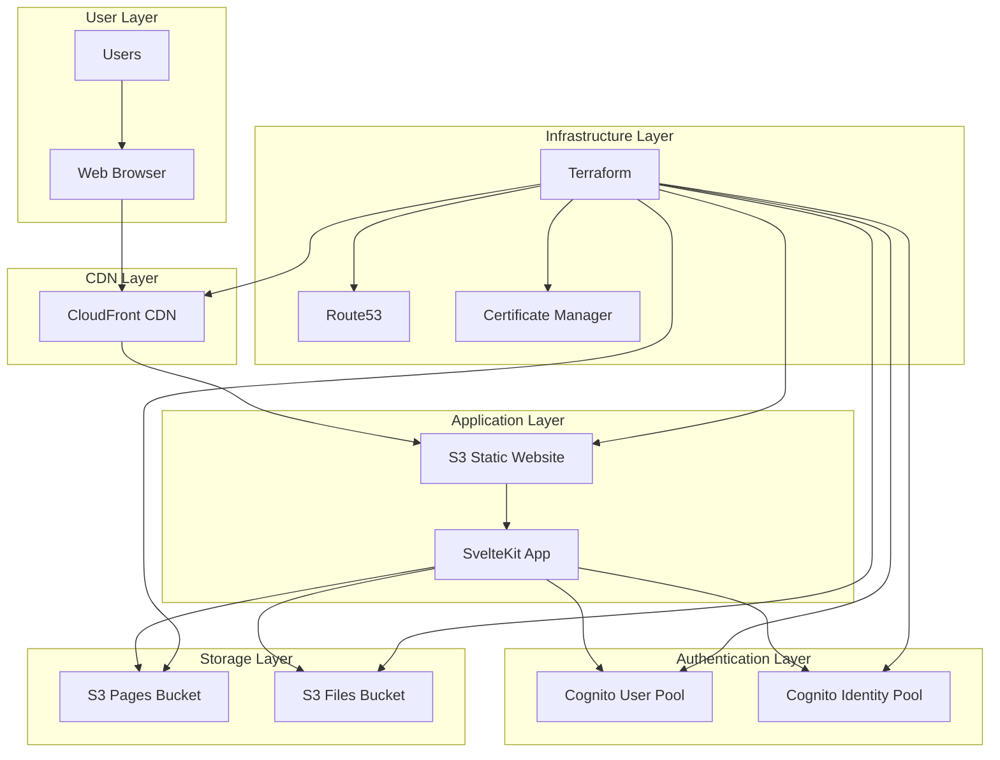
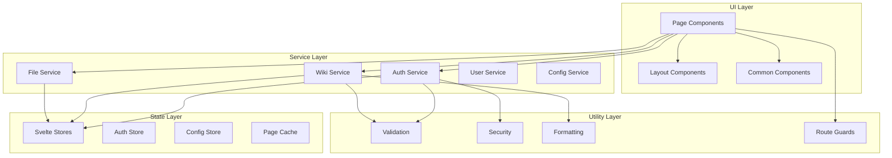
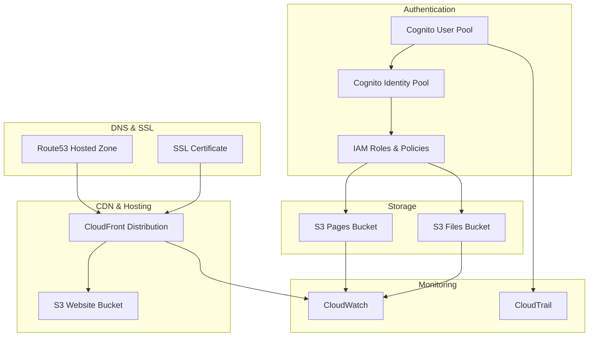
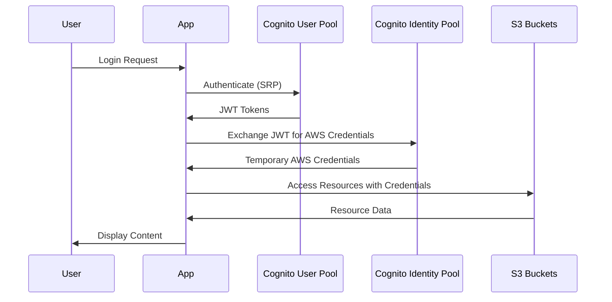
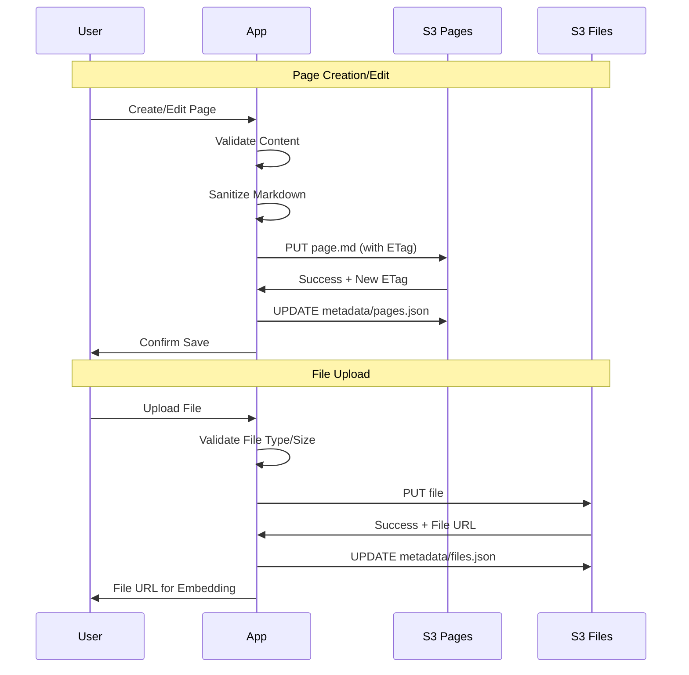
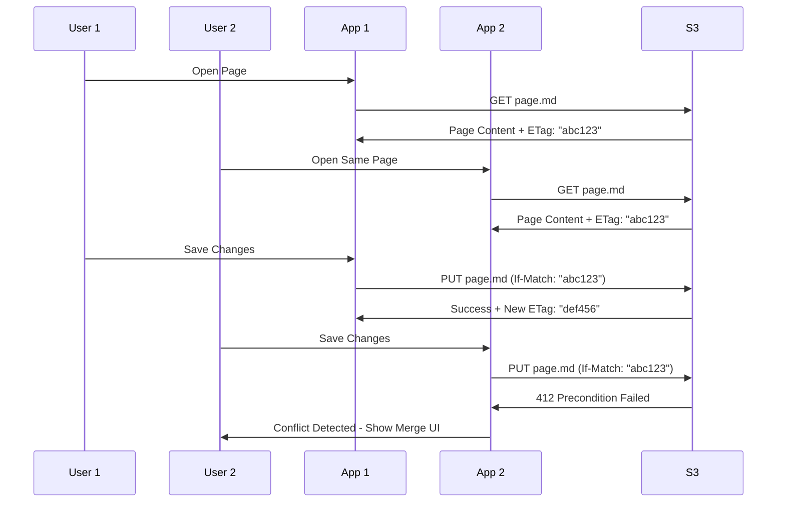
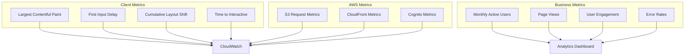

# MarkS3 Architecture Guide

This document provides a comprehensive overview of MarkS3's architecture, design decisions, and technical implementation details.

## Table of Contents

- [Overview](#overview)
- [System Architecture](#system-architecture)
- [Frontend Architecture](#frontend-architecture)
- [AWS Infrastructure](#aws-infrastructure)
- [Data Flow](#data-flow)
- [Security Architecture](#security-architecture)
- [Performance Considerations](#performance-considerations)
- [Scalability](#scalability)
- [Design Decisions](#design-decisions)
- [Future Considerations](#future-considerations)

## Overview

MarkS3 is a **serverless markdown wiki system** that runs entirely on AWS infrastructure without requiring traditional backend servers. The architecture is designed around the following principles:

- **Serverless-First**: No server management, automatic scaling
- **Cost-Effective**: Pay only for what you use
- **Secure**: AWS-native authentication and authorization
- **Performant**: Global CDN distribution and client-side rendering
- **Maintainable**: Modern web technologies and clear separation of concerns

### Key Architectural Decisions

1. **Client-Side Only**: All application logic runs in the browser
2. **Direct AWS Integration**: Browser communicates directly with AWS services
3. **Static Site Hosting**: Application served as static files from S3/CloudFront
4. **Optimistic Locking**: ETag-based conflict resolution for concurrent editing
5. **Role-Based Security**: Cognito-based authentication with S3 bucket policies

## System Architecture

### High-Level Architecture



### Component Overview

| Component | Purpose | Technology |
|-----------|---------|------------|
| **Frontend App** | User interface and business logic | SvelteKit + TypeScript |
| **CDN** | Global content delivery | AWS CloudFront |
| **Static Hosting** | Application hosting | AWS S3 Static Website |
| **Authentication** | User management | AWS Cognito |
| **Storage** | Content and file storage | AWS S3 |
| **Infrastructure** | Resource provisioning | Terraform |
| **DNS & SSL** | Domain and certificates | Route53 + ACM |

## Frontend Architecture

### SvelteKit Application Structure

```
src/
├── lib/
│   ├── components/          # Reusable UI components
│   │   ├── auth/           # Authentication components
│   │   ├── editor/         # Markdown editor components
│   │   ├── browser/        # Page browser components
│   │   ├── files/          # File management components
│   │   ├── admin/          # Admin panel components
│   │   └── common/         # Shared UI components
│   ├── services/           # Business logic services
│   │   ├── auth.ts         # Authentication service
│   │   ├── wiki.ts         # Wiki operations service
│   │   ├── files.ts        # File management service
│   │   ├── userManagement.ts # User admin service
│   │   └── configManagement.ts # Config service
│   ├── stores/             # State management
│   │   ├── auth.ts         # Authentication state
│   │   ├── config.ts       # Application config
│   │   └── pages.ts        # Page metadata cache
│   ├── types/              # TypeScript definitions
│   │   ├── auth.ts         # Auth-related types
│   │   ├── wiki.ts         # Wiki-related types
│   │   └── aws.ts          # AWS service types
│   └── utils/              # Utility functions
│       ├── validation.ts   # Input validation
│       ├── security.ts     # Security helpers
│       └── formatting.ts   # Text formatting
└── routes/                 # SvelteKit routes
    ├── +layout.svelte     # Root layout
    ├── +page.svelte       # Home page
    ├── edit/              # Page editing routes
    ├── browse/            # Page browsing routes
    ├── files/             # File management routes
    └── admin/             # Admin panel routes
```

### Component Architecture



### State Management

MarkS3 uses Svelte stores for reactive state management:

#### Authentication State
```typescript
interface AuthStore {
  user: User | null;
  isAuthenticated: boolean;
  isLoading: boolean;
  tokens: {
    accessToken: string | null;
    refreshToken: string | null;
    idToken: string | null;
  };
}
```

#### Configuration State
```typescript
interface ConfigStore {
  wiki: WikiConfig;
  aws: AWSConfig;
  isLoaded: boolean;
  isLoading: boolean;
}
```

#### Page Cache
```typescript
interface PageCacheStore {
  pages: Map<string, WikiPage>;
  metadata: Map<string, PageMetadata>;
  lastUpdated: Map<string, Date>;
}
```

## AWS Infrastructure

### Infrastructure Components



### S3 Bucket Structure

#### Website Bucket (`marks3-website-{env}`)
```
/
├── index.html              # SvelteKit app entry point
├── _app/                   # SvelteKit application files
│   ├── version.json
│   ├── app.js
│   └── app.css
├── assets/                 # Static assets
└── favicon.ico
```

#### Pages Bucket (`marks3-pages-{env}`)
```
/
├── pages/                  # Wiki pages
│   ├── index.md           # Home page
│   ├── docs/              # Documentation folder
│   │   ├── getting-started.md
│   │   └── api.md
│   └── team/              # Team pages
├── metadata/              # System metadata
│   ├── pages.json         # Page index
│   └── search-index.json  # Search index
└── config/                # Configuration
    └── wiki.json          # Wiki settings
```

#### Files Bucket (`marks3-files-{env}`)
```
/
├── images/                # Image uploads
│   ├── 2024/01/
│   └── 2024/02/
├── documents/             # Document uploads
├── attachments/           # Page attachments
└── metadata/              # File metadata
    └── files.json         # File index
```

### Cognito Configuration

#### User Pool Settings
- **Authentication Flow**: USER_SRP_AUTH
- **Password Policy**: Configurable strength requirements
- **MFA**: Optional, configurable per user
- **User Attributes**: email (required), given_name, family_name
- **Custom Attributes**: role (admin, regular, guest)

#### Identity Pool Settings
- **Unauthenticated Access**: Limited (guest role)
- **Authenticated Access**: Role-based permissions
- **Role Mapping**: Based on Cognito user attributes

### IAM Policies

#### Authenticated User Policy
```json
{
  "Version": "2012-10-17",
  "Statement": [
    {
      "Effect": "Allow",
      "Action": [
        "s3:GetObject",
        "s3:PutObject",
        "s3:DeleteObject"
      ],
      "Resource": [
        "arn:aws:s3:::marks3-pages-prod/pages/*",
        "arn:aws:s3:::marks3-files-prod/*"
      ],
      "Condition": {
        "StringEquals": {
          "cognito-identity.amazonaws.com:aud": "${aws:cognito-identity.amazonaws.com:aud}"
        }
      }
    }
  ]
}
```

#### Admin User Policy
```json
{
  "Version": "2012-10-17",
  "Statement": [
    {
      "Effect": "Allow",
      "Action": [
        "s3:*"
      ],
      "Resource": [
        "arn:aws:s3:::marks3-pages-prod/*",
        "arn:aws:s3:::marks3-files-prod/*",
        "arn:aws:s3:::marks3-pages-prod/config/*",
        "arn:aws:s3:::marks3-pages-prod/metadata/*"
      ]
    },
    {
      "Effect": "Allow",
      "Action": [
        "cognito-idp:AdminListGroupsForUser",
        "cognito-idp:AdminAddUserToGroup",
        "cognito-idp:AdminRemoveUserFromGroup"
      ],
      "Resource": "arn:aws:cognito-idp:*:*:userpool/*"
    }
  ]
}
```

## Data Flow

### Authentication Flow



### Page Operations Flow



### Concurrent Editing Flow



## Security Architecture

### Defense in Depth

```mermaid
graph TB
    subgraph "Application Security"
        XSS[XSS Protection]
        CSRF[CSRF Protection]
        VAL[Input Validation]
        SAN[Content Sanitization]
    end
    
    subgraph "Transport Security"
        HTTPS[HTTPS Only]
        HSTS[HSTS Headers]
        CSP[Content Security Policy]
    end
    
    subgraph "Authentication Security"
        MFA[Multi-Factor Auth]
        JWT[JWT Tokens]
        SRP[SRP Protocol]
        PWD[Password Policy]
    end
    
    subgraph "Authorization Security"
        RBAC[Role-Based Access]
        IAM[IAM Policies]
        BP[Bucket Policies]
        CORS[CORS Configuration]
    end
    
    subgraph "Infrastructure Security"
        VPC[VPC (Optional)]
        WAF[WAF (Optional)]
        SHIELD[AWS Shield]
        CT[CloudTrail Logging]
    end
```

### Security Layers

1. **Transport Layer Security**
   - HTTPS enforcement via CloudFront
   - HSTS headers for browser security
   - Strong TLS cipher suites

2. **Application Security**
   - Content Security Policy (CSP) headers
   - XSS protection via DOMPurify
   - Input validation and sanitization
   - CSRF protection (SvelteKit built-in)

3. **Authentication Security**
   - AWS Cognito SRP authentication
   - JWT token-based sessions
   - Optional MFA support
   - Configurable password policies

4. **Authorization Security**
   - Role-based access control (RBAC)
   - IAM policies for fine-grained permissions
   - S3 bucket policies for resource access
   - Cognito identity pool role mapping

5. **Data Security**
   - S3 server-side encryption (SSE-S3/SSE-KMS)
   - Encryption in transit (HTTPS/TLS)
   - Secure credential storage (browser)

### Threat Model

| Threat | Mitigation | Implementation |
|--------|------------|----------------|
| **XSS Attacks** | Content sanitization | DOMPurify for markdown |
| **CSRF Attacks** | Token validation | SvelteKit CSRF protection |
| **Injection Attacks** | Input validation | Strict validation functions |
| **Unauthorized Access** | Authentication | Cognito + IAM policies |
| **Privilege Escalation** | Role-based access | Cognito groups + IAM |
| **Data Breaches** | Encryption | S3 SSE + HTTPS |
| **Session Hijacking** | Secure tokens | JWT + secure storage |
| **DDoS Attacks** | Rate limiting | CloudFront + AWS Shield |

## Performance Considerations

### Frontend Performance

#### Bundle Optimization
- **Code Splitting**: Route-based splitting with SvelteKit
- **Tree Shaking**: Unused code elimination
- **Minification**: JavaScript and CSS compression
- **Asset Optimization**: Image compression and WebP conversion

#### Runtime Performance
- **Virtual Scrolling**: For large page lists
- **Lazy Loading**: Components and images
- **Caching**: Browser cache + service worker
- **Debouncing**: Search and auto-save operations

### CDN Performance

#### CloudFront Configuration
- **Global Edge Locations**: Reduced latency worldwide
- **Caching Strategy**: Static assets cached for 1 year
- **Compression**: Gzip/Brotli compression enabled
- **HTTP/2**: Modern protocol support

#### Cache Headers
```
# Static Assets
Cache-Control: public, max-age=31536000, immutable

# HTML Files
Cache-Control: public, max-age=0, must-revalidate

# API Responses
Cache-Control: private, no-cache
```

### AWS Service Performance

#### S3 Optimization
- **Request Patterns**: Avoid hot-spotting with random prefixes
- **Multipart Uploads**: For files >100MB
- **Transfer Acceleration**: For global uploads (optional)
- **Intelligent Tiering**: Cost optimization for infrequent access

#### Cognito Optimization
- **Connection Pooling**: Reuse SDK clients
- **Token Caching**: Cache valid tokens client-side
- **Batch Operations**: Group user management operations

## Scalability

### Horizontal Scaling

MarkS3 scales automatically through AWS services:

1. **CloudFront**: Global CDN with automatic scaling
2. **S3**: Virtually unlimited storage and throughput
3. **Cognito**: Scales to millions of users
4. **Client-Side**: No server bottlenecks

### Scaling Considerations

#### User Growth
- **Cognito Limits**: 40M users per pool
- **S3 Requests**: 3,500 PUT/5,500 GET per second per prefix
- **CloudFront**: No practical limits for most use cases

#### Content Growth
- **S3 Storage**: Virtually unlimited
- **File Size**: 5TB maximum per object
- **Search Performance**: Consider external search service for >10k pages

#### Geographic Distribution
- **Multi-Region**: Deploy in multiple AWS regions
- **Edge Locations**: CloudFront provides global coverage
- **Data Residency**: Choose appropriate AWS regions for compliance

### Performance Monitoring



## Design Decisions

### Technology Choices

#### Frontend Framework: SvelteKit
**Rationale:**
- Smaller bundle sizes compared to React/Vue
- Excellent TypeScript support
- Built-in SSG capabilities
- Modern development experience
- Strong performance characteristics

**Alternatives Considered:**
- React + Next.js: Larger ecosystem but bigger bundles
- Vue + Nuxt: Good option but less performance-focused
- Vanilla JS: Too much boilerplate for complex app

#### State Management: Svelte Stores
**Rationale:**
- Native to Svelte ecosystem
- Reactive by design
- Minimal boilerplate
- TypeScript-friendly

**Alternatives Considered:**
- Redux: Too complex for this use case
- Zustand: Good but external dependency
- Context API: Not available in Svelte

#### Markdown Editor: Milkdown
**Rationale:**
- Plugin-based architecture
- Real-time preview
- Extensible and customizable
- Good TypeScript support

**Alternatives Considered:**
- Monaco Editor: Too heavy for markdown
- CodeMirror: Good but more complex setup
- Simple textarea: Poor user experience

### Architecture Decisions

#### Serverless Architecture
**Rationale:**
- Cost-effective for variable workloads
- No server maintenance overhead
- Automatic scaling
- High availability through AWS

**Trade-offs:**
- Limited to client-side processing
- Dependent on AWS service limits
- More complex authentication flow

#### Direct AWS Integration
**Rationale:**
- Eliminates backend server costs
- Reduces architectural complexity
- Leverages AWS security model
- Better performance (fewer hops)

**Trade-offs:**
- Vendor lock-in to AWS
- Client-side credential management
- Limited server-side processing options

#### Optimistic Locking
**Rationale:**
- Simple conflict resolution
- Good performance for low-conflict scenarios
- Leverages S3 ETag functionality
- Clear user feedback on conflicts

**Trade-offs:**
- Manual conflict resolution required
- Not suitable for high-conflict scenarios
- Requires user education

### Security Decisions

#### Client-Side Authentication
**Rationale:**
- Leverages AWS Cognito security
- No server-side session management
- Scales automatically
- Industry-standard JWT tokens

**Trade-offs:**
- Tokens stored client-side
- Limited server-side validation options
- Requires careful token handling

#### Role-Based Access Control
**Rationale:**
- Simple permission model
- Maps well to Cognito groups
- Easy to understand and manage
- Sufficient for most wiki use cases

**Trade-offs:**
- Less granular than ACLs
- Requires careful role design
- May need custom attributes for complex scenarios

## Future Considerations

### Planned Enhancements

#### Search Improvements
- **Full-Text Search**: Integration with AWS OpenSearch
- **Faceted Search**: Filter by tags, authors, dates
- **Search Analytics**: Track popular searches

#### Collaboration Features
- **Real-Time Editing**: WebSocket-based collaborative editing
- **Comments System**: Page and inline comments
- **Change Notifications**: Email/Slack notifications for changes

#### Advanced Features
- **Plugin System**: Extensible architecture for custom features
- **API Gateway**: RESTful API for external integrations
- **Mobile App**: React Native or Flutter mobile application

### Scalability Improvements

#### Performance Optimizations
- **Service Worker**: Offline support and caching
- **GraphQL**: More efficient data fetching
- **Edge Computing**: Lambda@Edge for dynamic content

#### Infrastructure Enhancements
- **Multi-Region**: Active-active deployment across regions
- **Backup Strategy**: Cross-region replication and point-in-time recovery
- **Monitoring**: Enhanced observability with X-Ray and custom metrics

### Technology Evolution

#### Framework Updates
- **Svelte 5**: Migrate to latest Svelte version
- **TypeScript 5+**: Leverage new language features
- **Vite 5**: Build tool improvements

#### AWS Service Integration
- **EventBridge**: Event-driven architecture for notifications
- **Step Functions**: Complex workflow orchestration
- **AppSync**: GraphQL API with real-time subscriptions

---

This architecture guide is a living document that evolves with the MarkS3 project. For implementation details and code examples, refer to the source code and API documentation.